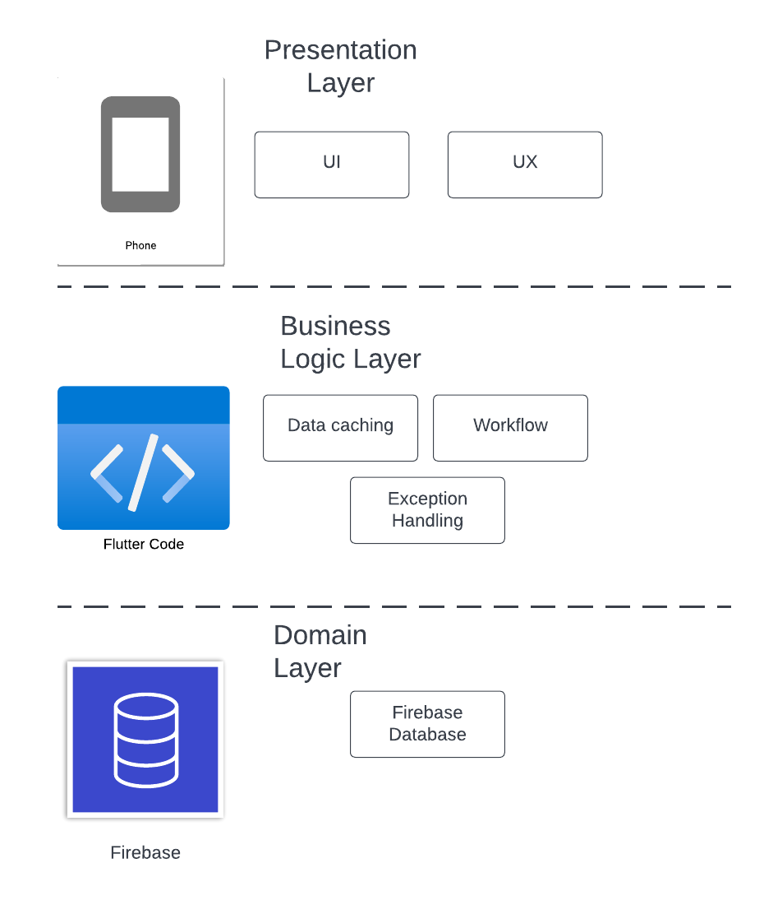
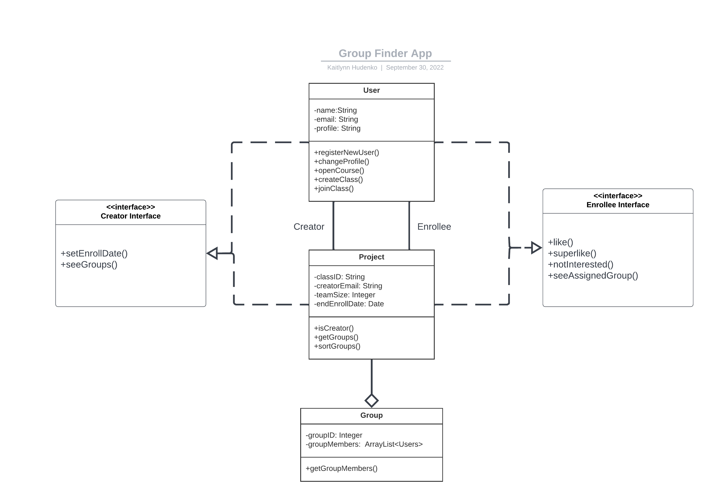
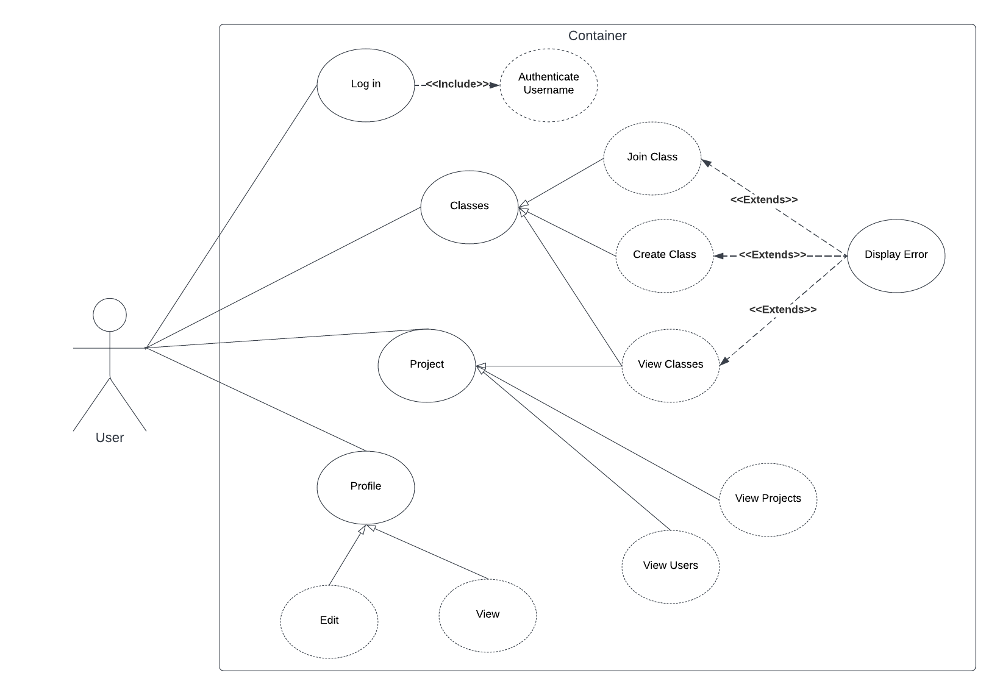
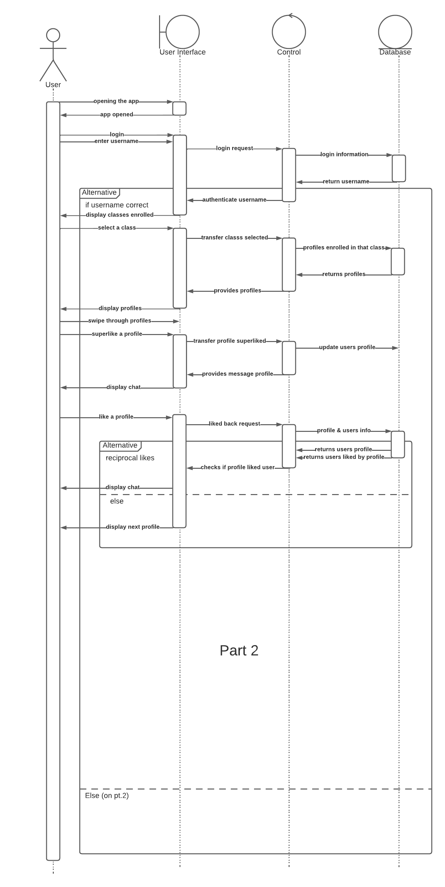
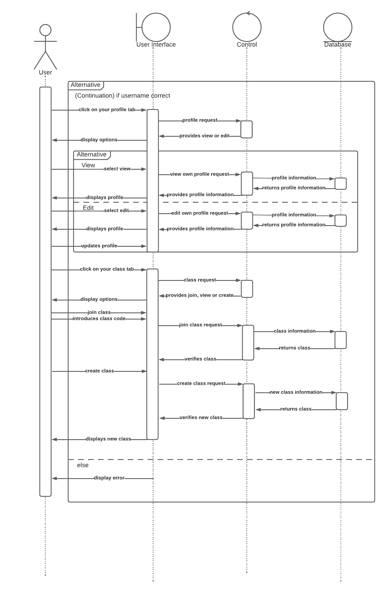
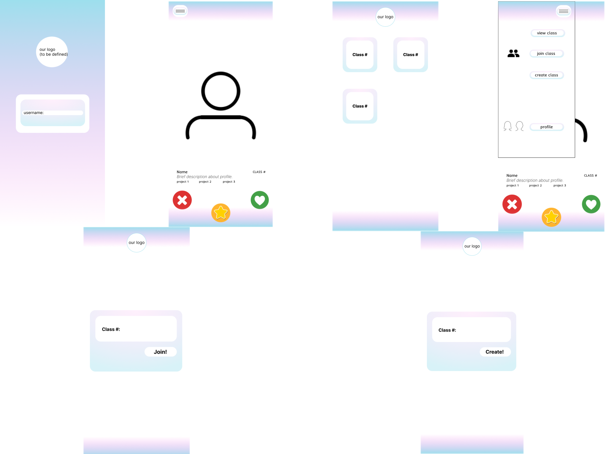

@ -1,6 +1,20 @@

# Group-Project-Finder

Group Project App for CIS 350 at Grand Valley State University
 Created by: Ben Kelley, Blanca Gonzalez, and Kaitlynn Hudenko 

## Abstract

A common problem students face in class is finding partners for a class project. It can be awkward sometimes and difficult to find a group quickly. It is also impossible to learn about every student in the class in order to make an informed decision about which person would be the best choice for you to work with. It can also be disruptive to the learning environment if students are scrambling to find groups. We aim to fix this problem with our app, "APP NAME HERE". Users will be able to swipe through a list of other users in the same project. Using brief profiles a user can pick who they would prefer to work with and who they would prefer not to for a particular project. The app will then sort the results and make groups for the project. This app will make the process of finding a group easy and stress free. It will also help professors and project coordinators keep track of who is in what group.

## Introduction

Because forming groups for projects can be awkward and hard we have decided to build a mobile app to fix that. Everyone has a phone and with a minimal amount of clicks and swiping you can have a group formed before you even have to talk to anyone about it. This app will be based on iOS and Android using a combination of Flutter and Firebase so it will be available to everyone. Because we do not have as much time as we would like to develop this app we will only include the basics. Swiping, joining projects, creating projects, viewing all joined projects, and editing your profile. There will be a minimal amount of authentication involved, just something basic enough to store usernames. Hopefully with this project we can change the way students and workers create teams and start projects.

### Architecture

### UML Diagrams

1. 
2. 
3. 
4. 

### UI Designs

### Links for project

1. Jira - https://groupprojectfinder.atlassian.net/jira/software/projects/GPF/boards/1
2. Flutter Documentation - https://docs.flutter.dev/get-started/install/windows
