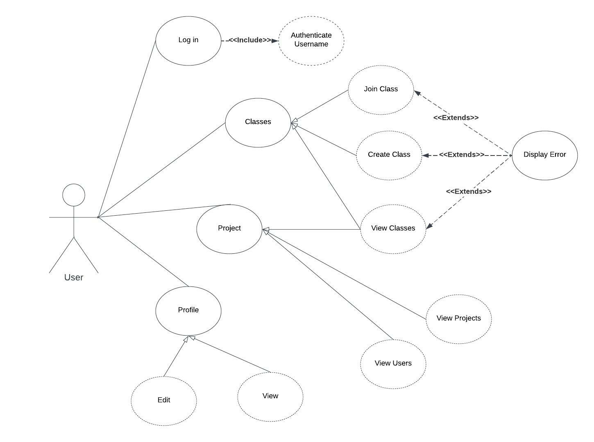

@ -1,6 +1,20 @@

# Group-Project-Finder

Group Project App for CIS 350 at Grand Valley State University
 Created by: Ben Kelley, Blanca Gonzalez, and Kaitlynn Hudenko 

## Abstract

A common problem students face in class is finding partners for a class project. It can be awkward sometimes and difficult to find a group quickly. It is also impossible to learn about every student in the class in order to make an informed decision about which person would be the best choice for you to work with. It can also be disruptive to the learning environment if students are scrambling to find groups. We aim to fix this problem with our app, "APP NAME HERE". Users will be able to swipe through a list of other users in the same project. Using brief profiles a user can pick who they would prefer to work with and who they would prefer not to for a particular project. The app will then sort the results and make groups for the project. This app will make the process of finding a group easy and stress free. It will also help professors and project coordinators keep track of who is in what group.

## Introduction

## Documentation

The group project finder app will have flutter running the frontend and firebase running the backend. The reason we chose flutter and firebase is because we wanted to get some experience with these technologies and because Google developed both of them. This will allow for seamless integration of the database.

The app will complete the following.

1. Users can login or register an account (will only store usernames for now)
2. Users can join, create, and view different classes
3. Users can edit their profile
4. Users will be able to swipe between different classmates in each class until a group is formed

### UML Diagrams

1. 
2. 
3. 
4. 

### Links for project

1. Jira - https://groupprojectfinder.atlassian.net/jira/software/projects/GPF/boards/1
2. Flutter Documentation - https://docs.flutter.dev/get-started/install/windows
